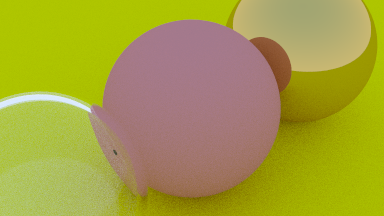

# Ray-tracer-rs


[](https://github.com/GarfieldZHU/ray-tracer-rs/actions?query=workflow%3ARay-tracer)
[](./LICENSE)
[](.)


A simple ray tracer implemented in Rust, followed [Ray Tracing in One Weekend](https://raytracing.github.io/books/RayTracingInOneWeekend.html) seires.

## Get started

- Install the [Rust](https://www.rust-lang.org/).
  On MacOS or Linux, run the below command to get ready:
  ```bash
    curl --proto '=https' --tlsv1.2 -sSf https://sh.rustup.rs | sh
  ```

- Clone this repo.
  ```bash
    git clone https://github.com/GarfieldZHU/ray-tracer-rs
  ``` 

- Run, get the ray tracing image (in [.ppm](https://en.wikipedia.org/wiki/Netpbm#File_formats) format):
  ```bash
    cargo run > raytracer.ppm
  ```

## Progress

#### Latest sample



#### [In one weekend](https://raytracing.github.io/books/RayTracingInOneWeekend.html)
- [x] Output image
- [x] Ray and camera
- [x] Sphere with ray
- [x] Surface normal
- [x] Antialiasing
- [x] Surface material
- [x] Metal sphere
- [x] Dielectrics
- [x] Move camera
- [ ] Defocus blur
- [ ] Final scene

#### [The next week](https://raytracing.github.io/books/RayTracingTheNextWeek.html)

#### [The Rest of Life](https://raytracing.github.io/books/RayTracingTheRestOfYourLife.html)


## References

- [Ray Tracing in One Weekend - The Book Series](https://raytracing.github.io/) 
